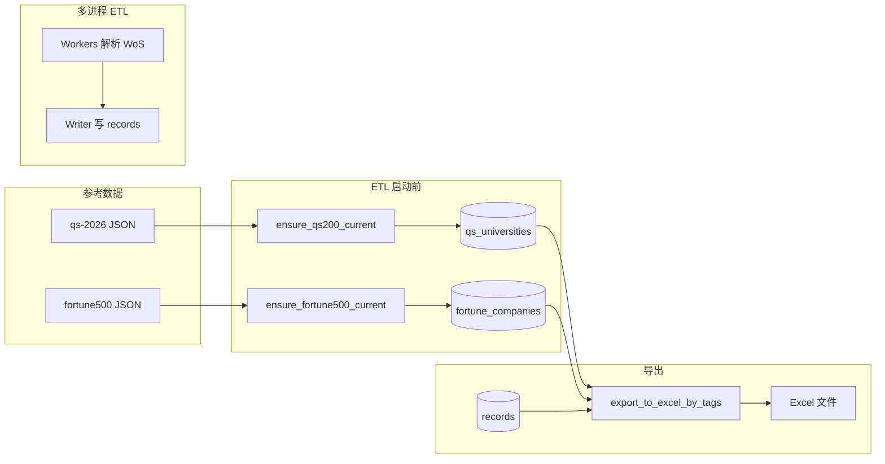

# QS 前 200 与 Fortune 500：数据流、匹配方法与导出字段说明

本文档基于当前代码库（参见仓库根目录 `AGENTS.md`）整理，说明 **QS 前 200 大学**与 **《财富》世界 500 强**两类参考数据如何进入系统、如何与 WoS 清洗记录对齐，以及导出 Excel 时的字段与流程。

---

## 1. 在项目中的定位

- **业务目标**：在批量解析 WoS 导出的 Excel/CSV 后，可选地根据 **通讯作者邮箱域名** 与 **机构名称**（及规范化字段）判断记录是否命中 QS200 或 Fortune500，并在导出时附带命中详情列、仅保留命中行（可组合）。
- **核心模块**：
  - `core/qs200.py`：QS 维表装载、规范化、域名/校名匹配。
  - `core/fortune500.py`：Fortune 维表装载、公司名规范化、域名/公司名匹配。
  - `core/exporter.py`：`export_to_excel_by_tags` 在导出时加载维表、逐行匹配、写 Excel 列并做行过滤。
  - `core/concurrency.py`：SQLite 表结构、`qs_universities` / `fortune_companies` 建表；ETL 启动前同步 JSON → 库。
- **参考数据文件**（运行期依赖，打包时随 `JournalCleaner.spec` 分发）：
  - `DB/qs-2026-merged-domain-top200.json`
  - `DB/fortune500-2025.json`

---

## 2. 数据来源与 JSON 字段约定

### 2.1 QS200 JSON（数组）

默认路径：`core/qs200.py` 中 `default_qs200_json_path()` → 开发环境为项目下 `DB/qs-2026-merged-domain-top200.json`；PyInstaller 打包后为 `_MEIPASS/DB/...`。

每条元素为对象，导入时读取的键：

| JSON 键 | 含义 | 入库说明 |
|--------|------|----------|
| `rank` | 排名 | 若为纯数字则存为整数，否则可能为 `NULL` |
| `university` | 学校官方名称 | 文本 |
| `country` | 国家/地区 | 文本 |
| `score` | 得分 | 尝试解析为浮点，失败则 `NULL` |
| `domain` | 主域名 | **必填**：规范化后 `domain_norm` 为空则跳过该条 |

**主键/冲突处理**：以 `domain_norm`（规范化域名）为唯一键，`INSERT ... ON CONFLICT(domain_norm) DO UPDATE` 做 upsert。`sync_qs200_from_json` 还会删除 JSON 中已不再出现的 `domain_norm` 行，使表与 JSON 一致。

### 2.2 Fortune500 JSON（数组）

默认路径：`core/fortune500.py` 中 `default_fortune500_json_path()` → `DB/fortune500-2025.json`。

| JSON 键 | 含义 | 入库说明 |
|--------|------|----------|
| `rank` | 排名 | 文本存储 |
| `company` | 公司名称 | 可能含换行（中文名 + 英文名）；英文名校提取规则见下 |
| `revenue_musd` | 营收（百万美元） | 文本 |
| `country` | 国家 | 文本 |
| `industry` | 行业 | 文本 |
| `website` | 网站 URL | 文本 |
| `domain` | 主域名 | **必填**：`domain_norm` 为空则跳过 |

**英文名提取**（`extract_company_english_name`）：若 `company` 含 `\n`，取 **最后一行非空** 作为英文公司名（用于展示与规范化）；否则用整段文本。

**主键/冲突**：同样以 `domain_norm` 唯一 upsert；`sync_fortune500_from_json` 会删除不在当前 JSON 中的旧行。

---

## 3. SQLite 维表结构（摘要）

在 `core/concurrency.py` 的 `_ensure_db_schema` 中创建/补全。

### 3.1 `qs_universities`

| 列名 | 类型 | 说明 |
|------|------|------|
| `id` | INTEGER PK | 自增 |
| `rank` | INTEGER | QS 排名 |
| `university` | TEXT | 校名 |
| `country` | TEXT | 国家 |
| `score` | REAL | 得分 |
| `domain` | TEXT | 原始域名 |
| `university_norm` | TEXT | 校名规范化 |
| `domain_norm` | TEXT NOT NULL UNIQUE | 规范化域名（唯一） |

索引：`idx_qs_university_norm(university_norm)`。

### 3.2 `fortune_companies`

| 列名 | 类型 | 说明 |
|------|------|------|
| `id` | INTEGER PK | 自增 |
| `rank` | TEXT | 排名 |
| `company_en` | TEXT | 英文公司名（由 JSON `company` 解析） |
| `revenue_musd` | TEXT | 营收 |
| `country` | TEXT | 国家 |
| `industry` | TEXT | 行业 |
| `website` | TEXT | 网站 |
| `domain` | TEXT | 原始域名 |
| `company_norm` | TEXT | 公司名规范化 |
| `domain_norm` | TEXT NOT NULL UNIQUE | 规范化域名（唯一） |

索引：`idx_fortune_company_norm(company_norm)`。

### 3.3 `app_meta`（元数据）

用于记录 JSON 文件 SHA256，避免未变更时重复全量同步：

- QS：`qs200_json_sha256`
- Fortune：`fortune500_json_sha256`

函数 `ensure_qs200_current` / `ensure_fortune500_current`：若哈希与库中一致则跳过；否则调用 `sync_*_from_json` 并更新哈希。

### 3.4 `records` 表中的 QS 相关列

`records` 上存在 `qs_rank`, `qs_university`, `qs_domain`, `qs_score`, `qs_country`, `qs_matched_by` 等列（用于迁移与索引，如 `idx_records_qs_rank`）。**当前 Writer 进程的 `INSERT` 仅写入解析主流程字段，不包含上述 QS 列**；QS/Fortune **命中结果主要在导出阶段**计算并写入 **Excel**，而不是在 ETL 落库时逐条填充这些列。

---

## 4. ETL 阶段与维表同步流程

1. `core/concurrency.run_etl` 在启动多进程扫描/写入前，用**主进程**打开数据库并调用：
   - `_ensure_qs200_data(conn)` → `ensure_qs200_current(conn)`
   - `_ensure_fortune500_data(conn)` → `ensure_fortune500_current(conn)`
2. 作用：保证 `qs_universities`、`fortune_companies` 与各自默认 JSON 一致（按文件哈希决定是否执行 `sync_*`）。
3. Worker 仍只负责解析文件并向 Writer 推送 `records`/`errors`；**维表写入不在 Worker 内**，且与单 Writer 写 `records` 的规则一致（避免多进程争用）。

---

## 5. 匹配算法（核心逻辑）

### 5.1 共用：域名规范化 `normalize_domain`（`qs200.py`，Fortune 复用）

- 去首尾空白、转小写。
- 去掉 `http://`、`https://`、`mailto:` 前缀。
- 取第一个 `/`、`?` 前的主机部分。
- 去掉首尾 `.`；若以 `www.` 开头则去掉。

### 5.2 共用：域名后缀迭代

对给定域名，依次尝试：`a.b.edu` → `b.edu` → `edu`（用于学邮箱子域命中主校域）。

### 5.3 QS：`match_qs_university`

输入：

- `email`：从整邮地址提取域名后与维表比对。
- `institution`：机构字符串（导出时使用 `institution_norm`，否则 `institution`）。
- `domain_index` / `name_index`：由 `load_qs_universities` + `build_domain_index` / `build_name_index` 构建。

**步骤（按优先级）**：

1. **域名匹配**：从 `extract_email_domain(email)` 得到域名，对后缀链上每个片段查 `domain_index`，命中则返回 `(QSUniversity, "domain")`。
2. **校名精确规范化匹配**：`normalize_university_name(institution)`（展开缩写如 Univ→University、去括号、保留字母数字与扩展拉丁/CJK 等，转小写）→ 查 `name_index`，命中则 `"name_exact"`。
3. **校名模糊匹配**：在所有 `name_index` 键中，仅保留与 `inst_norm` **互为子串**的候选，用 `difflib.SequenceMatcher` 算相似度，取最高且 **≥ `name_similarity_threshold`（默认 0.88）** → `"name_fuzzy"`。
4. 否则返回 `(None, "")`。

**校名规范化要点**（`normalize_university_name`）：先 `expand_institution_abbreviations`（如 Natl→National），再去括号内容，非字母数字与部分 Unicode 字母范围替换为空格，压缩空白并小写。

### 5.4 Fortune：`match_fortune_company`

输入：

- `email_domain`：可直接传 `records.email_domain`；若为空导出逻辑会从 `email` 再解析。
- `institution`：同上，用机构字段做公司名匹配。
- `domain_index` / `name_index`：由 `load_fortune_companies` + `build_fortune_domain_index` / `build_fortune_name_index` 构建。

**步骤**：与 QS 类似——先域名后缀链，再 `normalize_company_name` 精确匹配，再子串约束下的模糊匹配（默认阈值 0.88）。

**公司名规范化**（`normalize_company_name`）：取英文公司名 → 小写 → 去括号 → 仅保留 `[a-z0-9]` 类字符为分词 → **去掉尾部常见公司后缀**（如 inc, ltd, corporation, gmbh 等列表 `_COMPANY_SUFFIXES`）→ 拼接为 `company_norm`。

---

## 6. 导出流程：`export_to_excel_by_tags`

定义于 `core/exporter.py`。

### 6.1 入口参数（与 QS/Fortune 相关）

| 参数 | 默认值 | 作用 |
|------|--------|------|
| `qs200_only` | `False` | 为真时同步 QS JSON、加载维表、计算 QS 列，并**仅保留 QS 命中行**（`qs_rank` 非空） |
| `qs_name_similarity_threshold` | `0.88` | QS 校名模糊匹配阈值 |
| `fortune500_only` | `False` | 为真时同步 Fortune JSON、加载维表、计算 Fortune 列，并**仅保留 Fortune 命中行** |
| `fortune_name_similarity_threshold` | `0.88` | Fortune 公司名模糊匹配阈值 |

二者同时为真时：保留 **QS 命中 ∪ Fortune 命中**（`qs_mask | fortune_mask`）。

### 6.2 查询与分页

- 使用 **keyset 分页**：`WHERE ... AND id > ? ORDER BY id LIMIT ?`，避免大库 `OFFSET` 性能问题。
- 从 `records` 读取的列包含：`id`, `file_name`, `row_index`, `short_name`, `country`, `ethnic_chinese`, `full_name`, `email`, `wos_categories`, `research_areas`, `email_validity`, `similarity`, `institution`, `institution_norm`, `email_domain`（若旧库缺列则用空字符串别名）。

### 6.3 是否导出机构/域名列

当 **未** 勾选 `qs200_only` 且 **未** 勾选 `fortune500_only` 时，导出列会 **排除** `institution`、`institution_norm`、`email_domain`（普通导出更精简）。  
开启任一“仅导出命中”选项时，会保留这三列，以便核对匹配依据。

### 6.4 逐行匹配与写入 DataFrame

对每个 chunk 构建的 `out_df`：

- **QS**（仅当 `qs200_only`）：  
  `match_qs_university(email=..., institution=institution_norm 或 institution, ...)`  
  将结果填入：`qs_rank`, `qs_university`, `qs_domain`, `qs_score`, `qs_country`, `qs_matched_by`。
- **Fortune**（仅当 `fortune500_only`）：  
  若 `email_domain` 为空则用 `extract_email_domain(email)`；  
  `match_fortune_company(...)`  
  填入：`fortune_rank`, `fortune_company`, `fortune_domain`, `fortune_revenue_musd`, `fortune_country`, `fortune_industry`, `fortune_matched_by`。

然后按上文规则用 `qs_rank` / `fortune_rank` 是否非空过滤行。

### 6.5 实际写入 Excel 的列（`out_columns`）

基础列由 GUI/参数控制（如是否含 `file_name`、`country`、`ethnic_chinese`、相似度阈值标签文件名等）。

在开启对应选项时 **额外追加**：

**仅 `qs200_only` 时追加：**

- `qs_rank`, `qs_university`, `qs_domain`, `qs_score`, `qs_country`

**仅 `fortune500_only` 时追加：**

- `fortune_rank`, `fortune_company`, `fortune_domain`, `fortune_revenue_musd`, `fortune_country`, `fortune_industry`

**说明**：`qs_matched_by` 与 `fortune_matched_by`（取值如 `domain`、`name_exact`、`name_fuzzy`）在内存 DataFrame 中会计算，但 **当前 `out_columns` 未包含这两项**，因此 **默认不会出现在导出的 xlsx 中**。若需落盘，需在 `exporter.py` 中把对应列加入 `out_columns`。

### 6.6 导出文件名

在关键词、`min_similarity` 等标签基础上加时间戳与分块序号，扩展名 `.xlsx`（`pandas.to_excel`）。

---

## 7. GUI 与配置

`gui/app.py`：

- 复选框 **「仅导出QS前200命中」** → `qs200_only=True`
- 复选框 **「仅导出Fortune500命中」** → `fortune500_only=True`
- 配置持久化：`~/.journal_cleaner_gui.json` 中的 `qs200_only`、`fortune500_only`

导出时调用 `export_to_excel_by_tags(..., qs200_only=..., fortune500_only=...)`。

---

## 8. 运维与自测脚本（摘自 `AGENTS.md`）

| 脚本 | 用途 |
|------|------|
| `tools/qs200_setup_db.py` | 初始化/迁移：QS 表与 `records` 上 QS 相关列 |
| `tools/qs200_import.py` | 将指定 JSON 导入 `qs_universities`（upsert） |
| `tools/qs200_quickcheck.py` | 快速检查库中 QS 行数 |
| `tools/fortune500_quickcheck.py` | 快速检查 Fortune 导入 |
| `tools/qs200_smoketest.py` | 端到端：建库、导入、带 `qs200_only` 的导出冒烟 |

---

## 9. 流程小结（Mermaid）

---

## 10. 实现细节与注意点

1. **命中在导出时计算**：与部分“入库即带 QS 列”的设计不同，当前主路径是在导出阶段读维表 + 读 `records` 行再匹配；`records` 上的 QS 列主要为 schema/工具链兼容保留。
2. **维表必须非空**：若勾选 `qs200_only` 但库中无 QS 行，会抛出 `RuntimeError` 提示检查 JSON；Fortune 同理。
3. **阈值可调**：校名/公司名模糊匹配默认 0.88，仅通过 `export_to_excel_by_tags` 参数暴露；GUI 当前未单独提供滑块，扩展时可接同一参数。
4. **Fortune 与 QS 同时开启**：导出为 **并集**，非交集。

---

*文档生成依据：仓库内 `AGENTS.md`、`core/qs200.py`、`core/fortune500.py`、`core/exporter.py`、`core/concurrency.py`、`gui/app.py` 及 `DB/*.json` 样例。*
